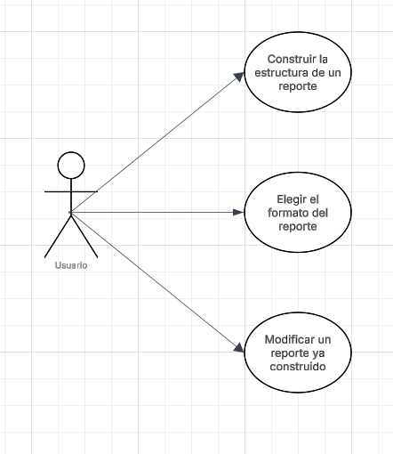

# Parcial-Corte-1-CVDS/DOSW

NIKOLAS MARTINEZ RIVERA GRUPO 2

DESARROLLO PARCIAL:

# DIAGRAMA DE CONTEXTO

# DIAGRAMA CASOS DE USO

# DIAGRAMA DE CLASES

Bueno los principios SOLID que se pueden ver en mi diagrama de clases son 
Open closed principalmente y SingleResponsability producto del uso de dos Patrones
de diseno.

a. Nombre del Patrón

`Builder`

b. Tipo de Patrón (Creacional, Estructural o de Comportamiento).

`Creacional`

c. Argumentación del porque se utiliza y como se ve reflejado en el
diagrama de clases anterior

La razon por la cual se utiliza es por sinergia entre el requerimiento del
caso de estudio y la definicion de builder con la frase `construya reportes paso a paso`
ahi es suficiente para saber que builder e sla mejor opcion pues nos permite
crear objetos complejos paso a paso.Esto en el diagrama de clases se ve reflejado 
en EciReports que actua como clase directora hacia la interfaz de ReportBuilder
el cual tiene como subclase que lo implementa a AcademicReportBuilder de una vez 
permitiendo la existencia de otro tipos de builders de reportes (puro open close papa).

a. Nombre del Patrón

`Decorator`

b. Tipo de Patrón (Creacional, Estructural o de Comportamiento).

`Estructural`

c. Argumentación del porque se utiliza y como se ve reflejado en el
diagrama de clases anterior

La razon del uso de Decorator es la posibilidad de cumplir con lo solicitado del 
caso de estudio `flexible para añadir nuevas características visuales` y en esas logicas
de anadir comportamientos en este caso caracteristicas visuales   facilmente Decorator es la mjor 
opcion pues en su misma descripcion esta que nos deja amarrar nuevos comportamientos
a los objetos al ponerlos en un wraperr, esto en mi diagrama de clases se ve reflejado con 
ReportFeature Decorator y el propio Report ambas clases abstractas, academic report que es subclase 
de Report junto a ReportFeatureDecorator, va a penas con la estructura de libro del patron de diseno
`Decorator`.

  
